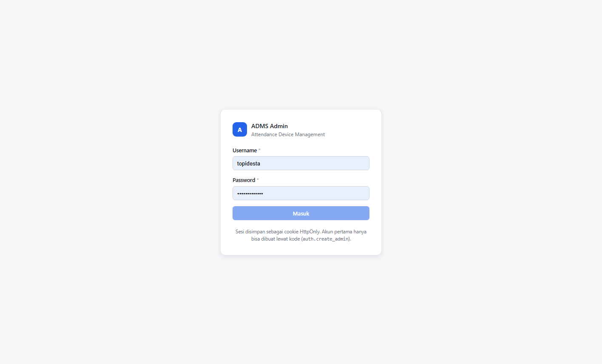
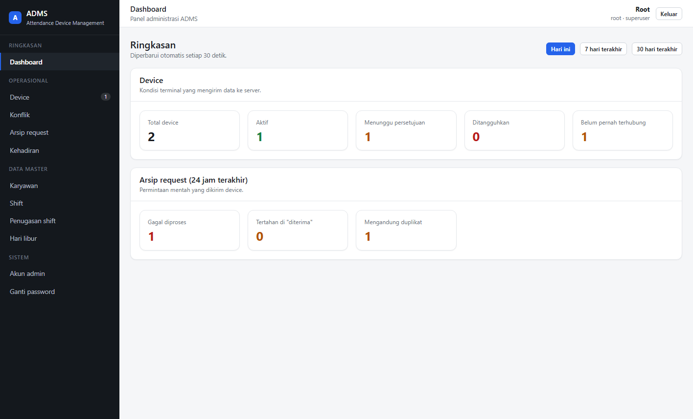
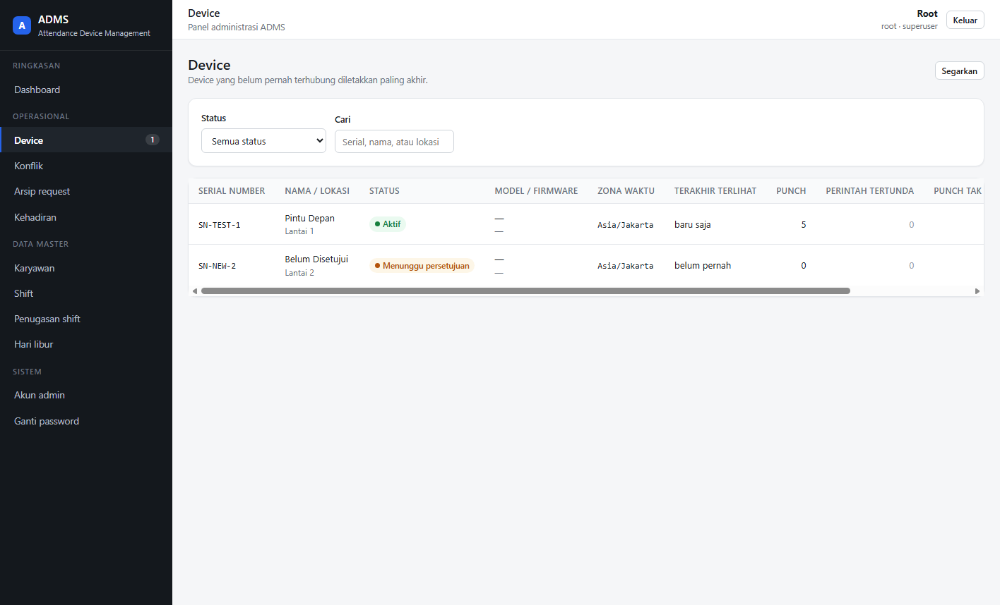
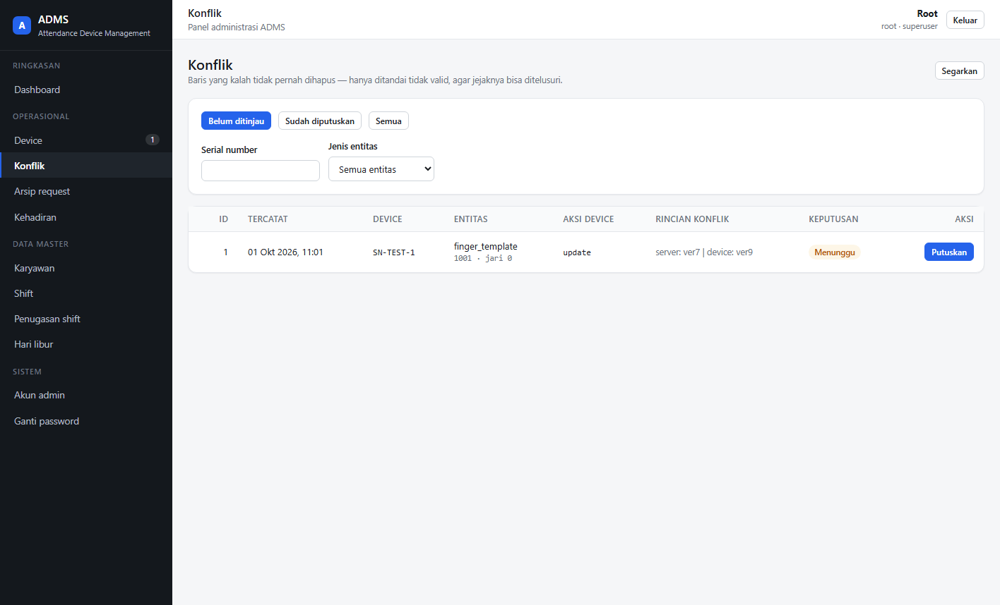
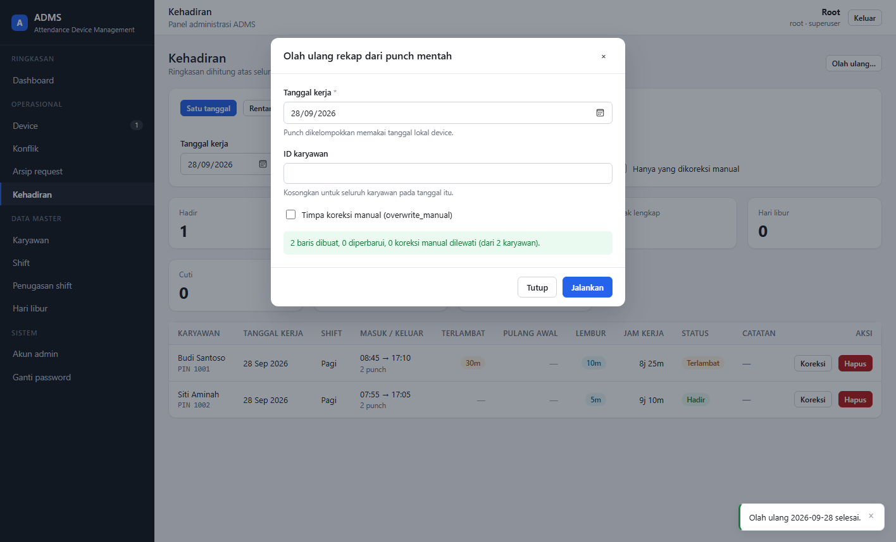
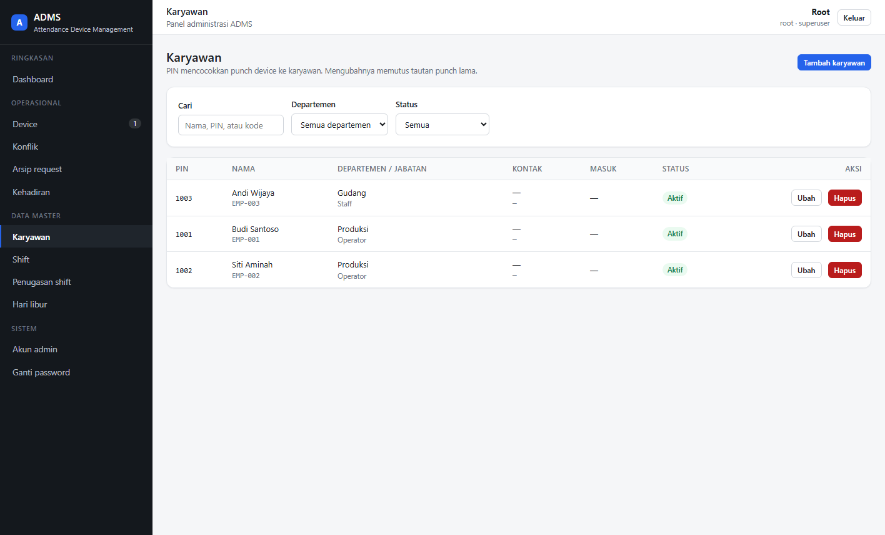
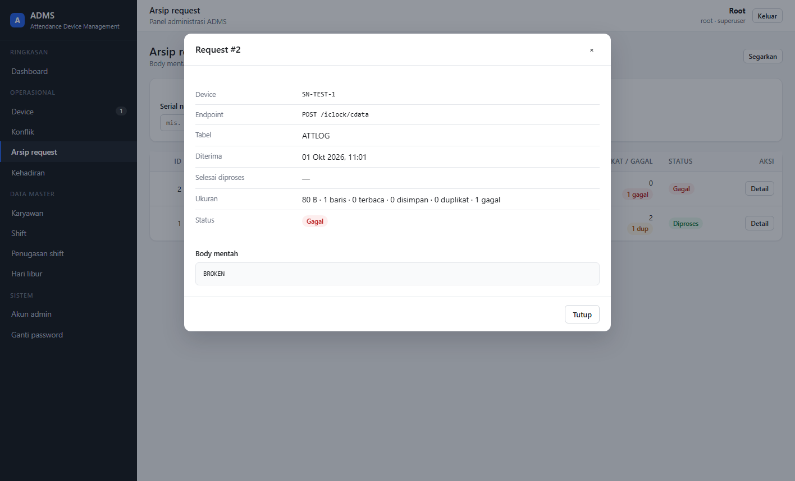
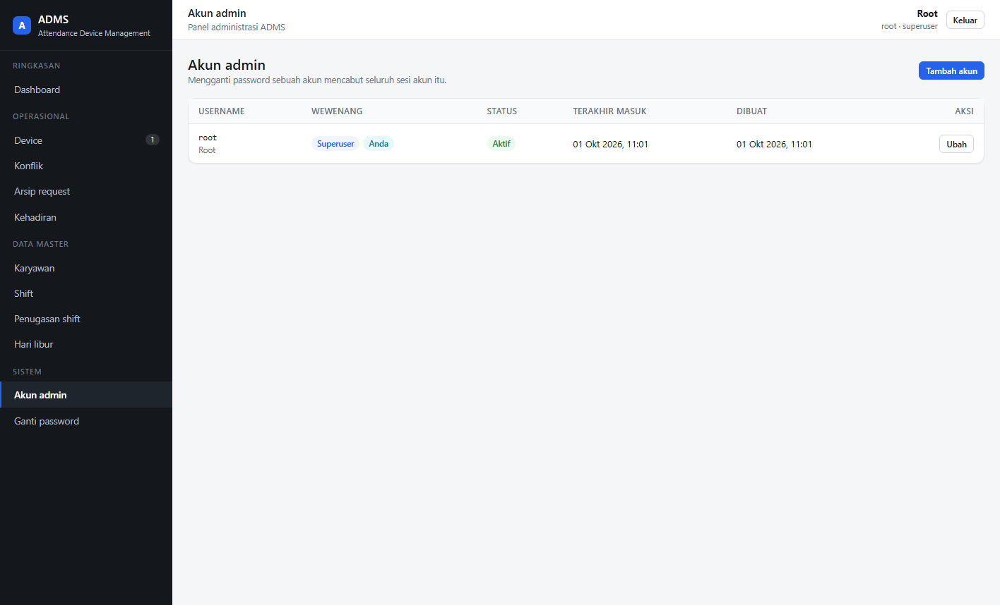

# ADMS (Attendance Device Management System)

Another ADMS Server with fastAPI (Python 3.*) in universe. Project still development. If you want working project use adms php version, in below.

> http://go.topidesta.my.id/adms-php

Project very slow movement, so.. be patient.

## Struktur proyek

```
main.py                 # titik masuk: `uvicorn main:app --reload`
app/
  application.py        # application factory `create_app()`
  config.py             # pembacaan & validasi environment (settings)
  logger.py             # konfigurasi logging terpusat (dipanggil create_app)
  database.py           # pool MySQL + jembatan async: run_in_thread/fetch/execute
  schemas.py            # model request/response (Pydantic)
  store.py              # penyimpanan sementara di memori
  routers/
    health.py           # GET / dan GET /health
    items.py            # GET /items dan GET /items/{item_id}
  iclock/               # sisi DEVICE (tanpa login): protokol push ZKTeco
    router.py           #   endpoint /iclock/*
    parser.py           #   parsing payload device
    ingest.py           #   orkestrasi satu request
    store.py            #   penulisan ke MySQL
    timezones.py        #   resolusi & validasi zona waktu device
  admin/                # sisi MANUSIA (wajib login): dashboard /api/admin/*
    __init__.py         #   perakitan router & prefiks /api/admin
    security.py         #   hashing password (PBKDF2) & token sesi
    auth.py             #   tabel admin_user / admin_session
    dependencies.py     #   current_admin (401) & require_superuser (403)
    schemas.py          #   model request/response dashboard
    helpers.py          #   pemetaan galat MySQL & normalisasi tipe kolom
    queries_*.py        #   kueri: devices, conflicts, attendance, master
    router_*.py         #   endpoint: auth, dashboard, devices, conflicts,
                        #             attendance, accounts
    router_master.py    #   perakit CRUD data master (empat berkas di bawah)
    router_employees.py     # karyawan
    router_shifts.py        # shift
    router_assignments.py   # penugasan shift
    router_holidays.py      # hari libur
tests/                  # pytest + FastAPI TestClient
  run_admin_e2e.sh      # pembungkus: MySQL sementara -> migrasi -> seed -> uji
  seed_admin_e2e.sql    # data contoh yang hasilnya sudah diprediksi
  verify_admin_e2e.py   # harness verifikasi dashboard terhadap MySQL nyata
  test_admin_ui_serving.py  # penyajian SPA di /admin (termasuk penjagaan ../)
frontend/               # SPA admin (React 19 + TS + Vite), dilayani di /admin
  index.html
  vite.config.ts        #   base '/admin/' + proxy /api -> 127.0.0.1:8000
  tsconfig.json
  src/
    main.tsx            #   titik masuk
    App.tsx             #   penyedia konteks + peta rute (basename '/admin')
    styles.css          #   sistem desain (tanpa kerangka CSS)
    api/
      client.ts         #   apiFetch, ApiError, penanganan 401 global
      types.ts          #   cermin app/admin/schemas.py
      endpoints.ts      #   satu kumpulan fungsi per grup endpoint
    lib/
      format.ts         #   pemformat tanggal/menit/ukuran
      labels.ts         #   label bahasa Indonesia
    auth/AuthContext.tsx
    components/         #   AppLayout, ProtectedRoute, DataTable, Modal, dst.
    pages/              #   12 layar (masuk, ringkasan, device, konflik, ...)
docs/                   # dokumen rancangan
  PRD-ADMS-PUSH.md      # PRD implementasi protokol push ZKTeco
  PROTOCOL-SPEC.md      # referensi teknis wire protocol (untuk parser)
  SCHEMA.md             # penjelasan skema database
  screenshots/          # tangkapan layar antarmuka web (dipakai readme ini)
migrations/             # skrip migrasi SQL
  001_init_adms_push.sql            # inti protokol push (7 tabel)
  002_biometric_sync_schedule.sql   # sidik jari, sync 2 arah, shift (6 tabel)
  003_admin_auth.sql                # akun admin & sesi login (2 tabel)
```

## Dashboard admin (`/api/admin/*`)

REST API (JSON) untuk kebutuhan operasional, sekaligus **antarmuka web** yang
dilayani server sendiri di `/admin`.

Seluruh endpoint kecuali `POST /api/admin/auth/login` **wajib login**. Sesi
dikirim lewat cookie `HttpOnly` + `SameSite=Lax` (`secure` mengikuti `DEBUG`),
dan token disimpan di database sebagai hash SHA-256.

| Grup | Endpoint | Kegunaan |
| --- | --- | --- |
| Autentikasi | `POST /auth/login`, `POST /auth/logout`, `GET /auth/me`, `POST /auth/password` | masuk, keluar, identitas, ganti password sendiri |
| Ringkasan | `GET /dashboard` | lencana angka: device, konflik, kehadiran |
| Device | `GET /devices`, `GET /devices/summary`, `GET|PATCH /devices/{id}`, `POST /devices/{id}/approve` | jawab "device ini kenapa diam?" |
| Arsip request | `GET /requests`, `GET /requests/{id}` | isi mentah yang dikirim device |
| Konflik | `GET /conflicts`, `GET /conflicts/summary`, `GET /conflicts/{id}`, `POST /conflicts/{id}/resolve` | tinjau konflik sinkronisasi **secara manual** |
| Kehadiran | `GET /attendance`, `GET /attendance/summary`, `PATCH|DELETE /attendance/{id}`, `POST /attendance/recompute` | rekap harian & koreksi manual |
| Karyawan | `GET|POST /employees`, `GET|PATCH|DELETE /employees/{id}`, `GET /employees/departments` | data karyawan |
| Shift | `GET|POST /shifts`, `GET|PATCH|DELETE /shifts/{id}` | jam kerja |
| Penugasan | `GET|POST /shift-assignments`, `DELETE /shift-assignments/{id}` | siapa masuk shift apa |
| Hari libur | `GET|POST /holidays`, `DELETE /holidays/{id}` | kalender libur |
| Akun admin | `GET|POST /accounts`, `PATCH /accounts/{id}` | **khusus superuser** |

Akun admin pertama harus dibuat lewat kode (`auth.create_admin`), karena
tidak ada cara login sebelum ada akun.

### Aturan yang tidak boleh dilanggar

- **Konflik selalu ditinjau manual** (keputusan #3). Konflik tidak punya jalur
  otomatis. Baris yang kalah di-`is_valid = 0`, **tidak pernah dihapus**, supaya
  jejak audit tetap ada.
- **`daily_attendance.is_manual` dihormati** (SCHEMA §11). Koreksi admin
  menulis `is_manual = 1`, dan olah-ulang otomatis melewatinya sambil
  melaporkan berapa baris yang dilewati.
- **Punch adalah data mentah.** Mengganti PIN karyawan memutus tautan punch
  lama dan melaporkan jumlahnya; punch tidak pernah ditulis ulang diam-diam.
- **Waktu dihitung pada jam dinding lokal** (`punch_at_local`), bukan UTC —
  `shift.start_time` adalah jam setempat (SCHEMA §16).

## Antarmuka web (`/admin`)

SPA React yang **dilayani server sendiri** — tidak ada langkah deploy terpisah.
Dibangun dengan React 19 + TypeScript + Vite, React Router 7 untuk rute, dan
TanStack Query untuk pemuatan data. CSS ditulis tangan (`src/styles.css`),
tanpa kerangka CSS: setiap dependensi adalah berkas yang ikut dibangun dan
dirawat.

### Tangkapan layar

Semua gambar di bawah diambil dari **verifikasi browser sungguhan** (Edge lewat
CDP) terhadap instance MySQL sementara berisi data contoh yang hasilnya sudah
diprediksi — bukan mockup.

**Halaman masuk.** Sesi disimpan sebagai cookie HttpOnly, jadi tidak ada token
yang bisa dibaca JavaScript. Pesan galat sengaja tidak membedakan "username
tidak ada" dari "password salah".



**Ringkasan.** Satu panggilan mengisi seluruh kepala dashboard. Angka yang
menunggu tindakan diberi warna dan bisa diklik menuju daftarnya; angka nol
tetap ditampilkan agar tidak terlihat seperti data yang gagal dimuat.



**Device.** Menjawab "device ini kenapa diam?". Yang ditonjolkan bukan
identitas device, melainkan kapan terakhir terlihat, berapa perintah yang belum
diambil device, dan berapa punch yang tidak tertaut ke karyawan mana pun.



**Konflik.** Tidak ada tombol "selesaikan semua" — itu keputusan desain server,
dan layar ini mengikutinya. Baris yang kalah ditandai `is_valid = 0`, tidak
pernah dihapus, supaya jejak auditnya tetap ada.



**Kehadiran.** Koreksi manual dan olah ulang dipisah tegas. Di sini olah ulang
2026-09-28 baru dijalankan dari punch mentah: Budi (masuk 08:45 terhadap shift
08:00 + toleransi 15 menit) terbaca **terlambat 30 menit**, Siti tepat waktu.
Ringkasan dihitung atas seluruh hasil filter, bukan hanya halaman yang tampil.



**Karyawan.** PIN adalah jembatan ke device: `attendance_log.pin` dicocokkan ke
`employee.pin`. Karena itu mengganti PIN memperingatkan lebih dulu dan
melaporkan berapa punch yang tautannya terputus.



**Detail arsip request.** Body mentah diambil saat detail dibuka, bukan ikut
pada daftar — arsip bisa mencapai 1 MB per baris. Inilah satu-satunya bukti yang
bisa dipercaya ketika angka `parsed_count` dan `stored_count` berbeda.



**Akun admin** (khusus superuser). Checkbox wewenang dan status aktif
dinonaktifkan untuk akun sendiri, mengikuti aturan server bahwa superuser tidak
bisa melucuti wewenangnya sendiri — tanpa itu, satu salah klik bisa membuat
sistem tidak punya superuser lagi.



### Membangun

```bash
cd frontend
npm ci            # atau `npm install` bila lockfile belum ada
npm run build     # tsc --noEmit && vite build  ->  frontend/dist
```

Server menyajikan `frontend/dist` di `/admin`. Bila `dist` belum ada, server
**tetap start** dan hanya mencatat peringatan — API wajib hidup karena device
bergantung padanya, sedangkan UI hanya cara manusia melihatnya.

### Mengembangkan

```bash
uvicorn main:app --reload          # terminal 1: API di 127.0.0.1:8000
cd frontend && npm run dev         # terminal 2: Vite di 127.0.0.1:5173
```

Buka `http://127.0.0.1:5173/admin/`. Vite memproksikan `/api` ke FastAPI supaya
browser melihat permintaan itu sebagai **same-origin** — bukan sekadar
menghindari CORS: cookie sesi (`HttpOnly`, `SameSite=Lax`) tidak ikut terkirim
pada permintaan lintas-origin, sehingga login akan tampak berhasil tetapi
sesinya tidak pernah terbaca.

### Tiga nilai yang wajib sama

`base` di `vite.config.ts`, `basename` di `src/App.tsx`, dan `UI_PREFIX` di
`app/application.py` harus sama-sama `/admin`. Bila salah satu berbeda, halaman
tampil **kosong tanpa galat apa pun** — karena itu ketiganya diberi komentar
silang.

### Keputusan antarmuka yang mengikuti aturan server

- **Tidak ada tombol "selesaikan semua"** pada konflik, dan **catatan/alasan
  wajib diisi** sebelum keputusan bisa dikirim. `sync_log` tidak punya kolom
  pelaku, jadi catatan itulah satu-satunya jejak siapa memutuskan apa.
- **"Koreksi" dan "Olah ulang" dipisah tegas** pada kehadiran. `is_manual`
  tidak pernah dikirim klien — server yang menyetelnya. Olah ulang
  memperingatkan keras saat `overwrite_manual` dicentang, dan selalu melaporkan
  berapa koreksi manual yang dilewati.
- **Perubahan PIN menampilkan laporan dampaknya**, bukan diringkas menjadi
  "Perubahan disimpan": server mengembalikan berapa punch yang tautannya
  terputus dan berapa yang tertaut ulang.
- **Superuser tidak bisa melucuti wewenang akunnya sendiri** — checkbox-nya
  dinonaktifkan untuk akun yang sedang dipakai, mengikuti aturan server.

## Rencana: ZKTeco iClock / ADMS Push Protocol

ADMS akan menerima absensi langsung dari device **ZKTeco X100C** (push), di
mana **device selalu menjadi klien** dan memanggil server kita — tidak perlu
ada port masuk ke jaringan cabang.

Keputusan yang sudah ditetapkan:

| Aspek | Keputusan |
|---|---|
| Device | ZKTeco **X100C** (fingerprint only); **firmware ADMS sudah tersedia** |
| Template biometrik | **Hanya sidik jari**, **2–4 jari per user** |
| Sinkronisasi user | **Dua arah**; konflik **selalu ditinjau manual** (tidak pernah ditimpa otomatis) |
| Sinkronisasi waktu | **TimeZone** per device (`tz_name`), diterapkan **saat parse** |
| Lokasi arsip template | **Object storage** — MySQL hanya menyimpan metadata |
| Retensi `iclock_request` | **30 hari** |
| Jadwal shift | **Ya**, untuk hitung keterlambatan |

> **Catatan:** ADMS adalah **fungsi opsional** pada X100C. Pemangku kepentingan
> sudah mengonfirmasi firmware yang dipakai mendukungnya, tetapi verifikasi
> ulang per unit baru — lihat PRD §0.3.

> **Prasyarat zona waktu:** bila memakai `CONVERT_TZ()` di MySQL, tabel zona
> waktu harus dimuat dulu, jika tidak hasilnya `NULL` (bukan error). Lihat
> SCHEMA §16.1b. Disarankan konversi tz di lapisan aplikasi (`zoneinfo`).

Baca berurutan:

1. [`docs/PRD-ADMS-PUSH.md`](docs/PRD-ADMS-PUSH.md) — tujuan, kebutuhan,
   kriteria penerimaan, tahapan
2. [`docs/PROTOCOL-SPEC.md`](docs/PROTOCOL-SPEC.md) — format wire, perintah,
   dan jebakan yang sudah terverifikasi di perangkat nyata
3. [`docs/SCHEMA.md`](docs/SCHEMA.md) — rancangan tabel + alasan tiap keputusan
   (§8b object storage, §13 konflik manual, §16 zona waktu)

Terapkan skema (15 tabel):

```bash
mysql -u <user> -p <database> < migrations/001_init_adms_push.sql
mysql -u <user> -p <database> < migrations/002_biometric_sync_schedule.sql
mysql -u <user> -p <database> < migrations/003_admin_auth.sql
```

Skema sudah diverifikasi terhadap **MySQL 8.0.15** nyata: ketiga migrasi jalan
bersih dan 15 tabel terbentuk (7 + 6 + 2).

## Menjalankan

```bash
cp env.example .env                  # lalu isi kredensial MySQL
pip install -r requirements.txt
mysql -u <user> -p <database> < migrations/001_init_adms_push.sql
mysql -u <user> -p <database> < migrations/002_biometric_sync_schedule.sql
mysql -u <user> -p <database> < migrations/003_admin_auth.sql

uvicorn main:app --reload            # API di 127.0.0.1:8000
```

Dokumentasi interaktif tersedia di `/docs` bila `DEBUG=true`.

Agar antarmuka webnya ikut hidup, bangun SPA-nya sekali (lihat
[Antarmuka web](#antarmuka-web-admin)) lalu buka `http://127.0.0.1:8000/admin`:

```bash
cd frontend && npm ci && npm run build
```

Akun admin pertama belum ada setelah migrasi — buat satu lewat kode, karena
tidak ada cara login sebelum ada akun:

```bash
python -c "
from app.admin import auth
from app.database import connection
with connection() as conn:
    auth.create_admin(conn, username='root', password='<password-kuat>',
                      display_name='Root', is_superuser=True)
    conn.commit()
"
```

## Pengujian

```bash
pytest -v
```

Pengujian tidak memerlukan MySQL — koneksi ke database dibuat malas
(lazy), sehingga test berjalan di mesin bersih.

Penyajian SPA di `/admin` dijaga `tests/test_admin_ui_serving.py` (10 uji):
rute sisi klien tidak menghasilkan 404 saat di-refresh, aset tersaji, catch-all
tidak menelan `/api/admin/*`, dan `../` tidak bisa dipakai membaca berkas di
luar direktori build.

Untuk sisi klien:

```bash
cd frontend
npm run typecheck     # tsc --noEmit
npm run build         # typecheck + build produksi
```

`tsc` yang hijau tidak membuktikan apa pun soal tampilan — perubahan UI perlu
diverifikasi di browser sungguhan.

### Verifikasi terhadap MySQL nyata

Suite di atas tidak menyentuh database, jadi ia tidak bisa membuktikan hal-hal
seperti `ON DUPLICATE KEY`, FK `RESTRICT`, atau apakah `SUM(...)` benar-benar
mengembalikan angka yang diharapkan. Untuk itu ada
`tests/verify_admin_e2e.py`: harness yang menjalankan seluruh alur dashboard
lewat HTTP (95 pemeriksaan) terhadap instance MySQL sementara, lengkap dengan
data contoh yang sudah diatur agar hasilnya bisa diprediksi.

```bash
bash tests/run_admin_e2e.sh
```

Skrip itu menyalakan instance sementara di port terpisah dengan
`--no-defaults` (**tidak menyentuh MySQL milik Anda** di 3306), menjalankan
`migrations/001..003`, memuat `tests/seed_admin_e2e.sql`, menjalankan harness,
lalu mematikan dan menghapus instance tersebut. Kode keluar 0 berarti lulus.

Harness ini pernah **menemukan tiga bug nyata** yang tidak terlihat oleh unit
test:

| Bug | Gejala |
| --- | --- |
| `AS leave` (kata kunci MySQL) | `GET /attendance` gagal 500 dengan galat sintaks 1064 |
| Perhitungan telat memakai jam **UTC** | telat 30 menit terbaca **1000 menit**, dan karyawan tepat waktu ikut berstatus `late` |
| Kolom `SET` dikembalikan sebagai `set` Python | `work_days` keluar sebagai `"{'MO', 'TU'}"` di JSON |

Ketiganya sekarang dijaga oleh `tests/test_admin_attendance_logic.py`.

## Konfigurasi

Semua konfigurasi dibaca dari environment variable dan divalidasi sekali
saat aplikasi start (lihat `app/config.py`). Variabel `MYSQL_HOST`,
`MYSQL_USER`, `MYSQL_PASSWORD`, dan `MYSQL_DB` bersifat wajib; bila salah
satu kosong aplikasi berhenti dengan pesan yang jelas alih-alih gagal
jauh di dalam kueri.

`LOG_LEVEL` (default `INFO`) mengatur level log aplikasi; `DEBUG` menyalakan
log per-request jalur ingest dan berguna saat menelusuri device yang diam.
Handler dan format log dipasang sekali oleh `app/logger.py` (dipanggil dari
`create_app()`), sehingga seluruh `logging.getLogger(__name__)` di modul lain
otomatis ikut terlihat.

`SERVE_UI` (default `true`) menyalakan penyajian SPA di `/admin`, dan
`FRONTEND_DIST` (default `frontend/dist`) menunjuk lokasi hasil build-nya.
Matikan `SERVE_UI` bila server hanya dipakai sebagai API.

# Authors

- [@mdestafadilah](https://github.com/mdestafadilah)
